# 🏛️ roofai

everything AI about roofs. 🏛️

```bash
pip install roofai
```

```mermaid
graph LR
    dataset_ingest["roofai<br>dataset<br>ingest<br>source=AIRS|CamVid<br>&lt;dataset-object-name&gt;"]

    dataset_review["roofai<br>dataset<br>review -<br>&lt;dataset-object-name&gt;"]

    gmaps_get_static_image["@gmaps<br>get_static_image - -<br>--lat &lt;lat&gt;<br>--lon &lt;lon&gt;"]

    gmaps_geocode["@gmaps<br>geocode - -<br>--address &lt;address&gt;"]

    semseg_train["roofai<br>semseg<br>train -<br>&lt;dataset-object-name&gt;<br>&lt;model-object-name&gt;"]

    semseg_predict["roofai<br>semseg<br>predict -<br>&lt;model-object-name&gt;<br>&lt;dataset-object-name&gt;<br>&lt;prediction-object-name&gt;"]

    address["🌐 address"]:::folder
    lat_lon["🌐 lat,lon"]:::folder
    AIRS["AIRS"]:::folder
    CamVid["CamVid"]:::folder
    dataset_object_name["📂 dataset object"]:::folder
    model_object_name["📂 model object"]:::folder
    prediction_object_name["📂 prediction object"]:::folder
    object_name["📂 object"]:::folder
    terminal["💻 terminal"]:::folder

    AIRS --> dataset_ingest
    CamVid --> dataset_ingest
    dataset_ingest --> dataset_object_name

    AIRS --> dataset_review
    dataset_object_name --> dataset_review
    dataset_review --> terminal

    dataset_object_name --> semseg_train
    semseg_train --> model_object_name

    model_object_name --> semseg_predict
    dataset_object_name --> semseg_predict
    semseg_predict --> prediction_object_name

    lat_lon --> gmaps_get_static_image
    gmaps_get_static_image --> object_name

    address --> gmaps_geocode
    gmaps_geocode --> object_name
    gmaps_geocode --> lat_lon

    classDef folder fill:#999,stroke:#333,stroke-width:2px;
```



|   |   |
| --- | --- |
| [`datasets`](./roofai/dataset) [](./roofai/dataset) Semantic Segmentation Datasets | [`semseg`](./roofai/semseg) [](./roofai/semseg) A Semantic Segmenter based on [segmentation_models.pytorch](<https://github.com/qubvel/segmentation_models.pytorch/blob/master/examples/cars%20segmentation%20(camvid).ipynb>). |
| [`Google Maps API`](./roofai/google_maps) [](./roofai/google_maps) Integrations with the [Google Maps Platform](https://developers.google.com/maps). |  |

---


[](https://github.com/kamangir/roofai/actions/workflows/pylint.yml) [](https://github.com/kamangir/roofai/actions/workflows/pytest.yml) [](https://github.com/kamangir/roofai/actions/workflows/bashtest.yml) [](https://pypi.org/project/roofai/) [](https://pypistats.org/packages/roofai)

built by 🌀 [`blue_options-4.223.1`](https://github.com/kamangir/awesome-bash-cli), based on 🏛️ [`roofai-6.108.1`](https://github.com/kamangir/roofai).
